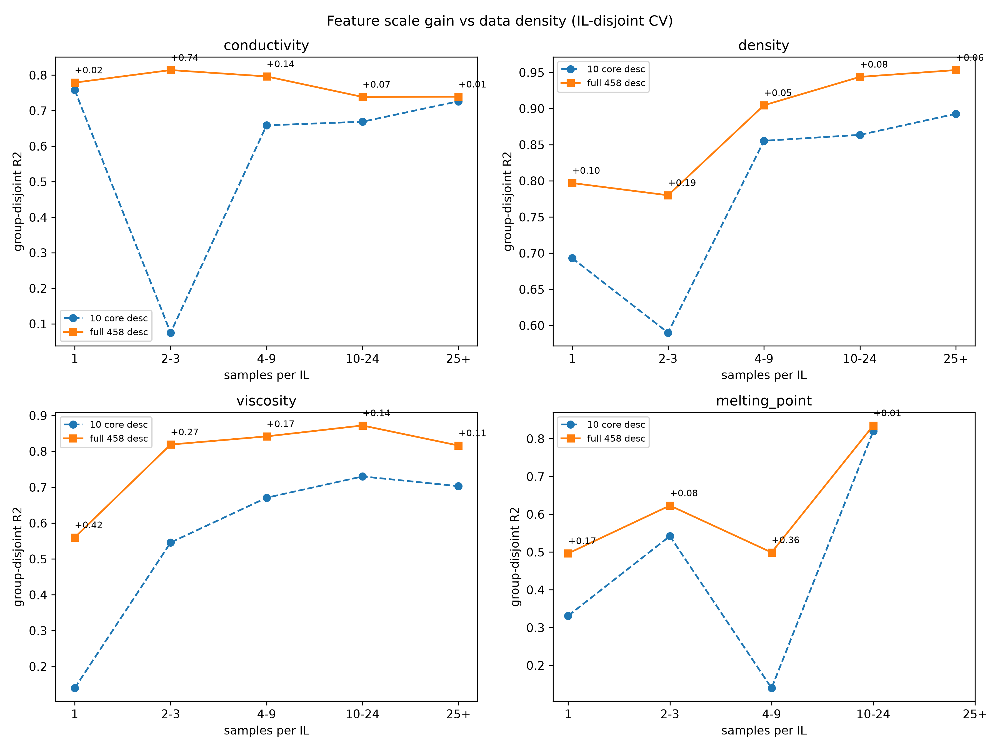

# Full-spectrum descriptors substitute for data density in ionic-liquid property prediction

**One-sentence summary:** Full descriptor sets lift group-disjoint R² most where per-IL data are scarcest, up to +0.42 for cold-start viscosity.

**Authors:** Fuxing Lin* (corresponding author; ORCID: 0009-0003-7588-6942)

**Affiliation:** Hunan Institute of Engineering

**Corresponding author:** Fuxing Lin; ORCID: 0009-0003-7588-6942; email: 3612411485@qq.com

---

## Abstract

Machine-learning prediction of ionic-liquid (IL) properties for unseen ion pairs is constrained by per-IL data density (1). Here I test whether feature engineering can relax that constraint. Holding data, validation, and model fixed, I replace ten hand-picked RDKit descriptors with the full RDKit descriptor set computed separately for cation and anion (458 features). Under IL-disjoint 5-fold CV, group-level R² rises from 0.70 to 0.74 for conductivity, 0.85 to 0.93 for density, 0.68 to 0.81 for viscosity, and 0.40 to 0.52 for melting point. Stratifying by per-IL samples, descriptor gains are largest where data are scarcest, lifting cold-start viscosity from 0.14 to 0.56 and conductivity in 2–3-sample groups from 0.08 to 0.81. Feature engineering and data acquisition are thus complementary levers on group-level transferability.

**Keywords:** ionic liquids; feature engineering; descriptor scale; group-disjoint validation; cold-start prediction

---

## 1. Introduction

Ionic liquids—salts that are liquid below roughly 373 K—have become a broadly tunable materials platform with applications across synthesis, separations, and electrochemistry (2–6). The cation–anion design space is combinatorially vast, with roughly 10⁶ synthetically accessible ion pairs, yet only a few thousand have been experimentally characterized (7,8). Machine learning has become the dominant route to quantitative structure–property prediction in chemistry and materials science (9,10), and descriptor-based QSPR remains its workhorse for ionic liquids: group-contribution schemes estimate density (11), temperature-dependent QSPRs capture viscosity (12,13), multi-property benchmarks span the field (14), and dedicated studies target conductivity (15–17), graph-neural-network representations (18), and melting point (19–21).

Most of these models, however, are validated with random point-wise splits, which the QSAR and machine-learning communities have repeatedly shown to overstate generalization to unseen chemistry (22–25). My companion study (1) introduced an IL-disjoint validation protocol and showed that point-wise validation inflates conductivity R² by 0.15–0.36, and that the properties failing under IL-disjoint splits—viscosity and melting point, with roughly one record per IL—are precisely those with the lowest per-IL data density. Expanding the database 7.7-fold to 88,077 records for 1,891 unique ion pairs from the NIST ILThermo v2.0 repository (26,27) converted those cold-start properties into predictable ones with unchanged features and models. That experiment suggested a sharp hypothesis: *data density, not model capacity, is the binding constraint on group-level extrapolation.*

The present study asks the complementary question: can the constraint be relaxed by feature engineering alone, with data, validation, and model all held fixed? Here I test the complementary direction with all three held fixed: gradient-boosting regression (28) on the full RDKit descriptor set (29), computed separately for cation and anion (458 features in total), with histogram-gradient boosting (30) used where speed matters, all implemented in scikit-learn (31) over SMILES-based ion-pair keys (32). If richer chemistry representations partially substitute for missing measurements, gains should concentrate in data-sparse groups—a directly testable prediction.

## 2. Results

### 2.1. From ten merged descriptors to 458 per-ion descriptors

The dataset comprises 84,077 experimental records for 1,891 unique ion pairs across four properties (viscosity, density, electrical conductivity, melting point), each identified by its cation|anion SMILES key (32); records were compiled and unit-standardized in the companion study from ILThermo (26,27), ILest (33), and iolitech (34). For every unique ion pair, I computed the complete RDKit descriptor list (~208 descriptors) independently for the cation and the anion, yielding 458 structural features per IL (229 cation + 229 anion); temperature is appended for the three temperature-dependent properties. Columns that are undefined for all ions (e.g., descriptors that fail for charged fragments) were removed; residual missing values were imputed by column median, then zero. The ten-descriptor baseline (molecular weight, log P, TPSA, H-bond donors/acceptors, rotatable bonds, aromatic rings, heavy-atom count, fraction of Csp³, ring count) is retained verbatim from the companion study so that the comparison is controlled.

### 2.2. Feature scale lifts all four properties under IL-disjoint validation

All models are gradient-boosting regressors (28) with the same hyperparameters as the companion study, evaluated by 5-fold GroupKFold on IL identity (31); viscosity and conductivity targets are log-transformed, as before. Table 1 and Figure 2 report group-disjoint R² and MAE for the ten-descriptor baseline versus the full 458-feature set. The baseline reproduces the companion results (0.698 for conductivity, 0.850 for density, 0.676 for viscosity, 0.397 for melting point), confirming that the comparison is apples-to-apples. Expanding the feature set improves every property: conductivity 0.698→0.740, density 0.850→0.926, viscosity 0.676→0.808, and melting point 0.397→0.523, with MAE reduced by 12–39%. The largest relative gains occur for the two properties whose per-IL coverage is lowest (melting point: 919 records for 642 ILs; viscosity: 25,260 records but 84% of ILs sampled across temperature).

**Table 1. Group-disjoint 5-fold R² under fixed data, model, and protocol.**

| Property | Records | ILs | Baseline R² | Full R² | ΔR² | Baseline MAE | Full MAE |
|----------|---------|-----|-------------|---------|-----|--------------|----------|
| Conductivity (ln κ) | 9,470 | 641 | 0.6978 | 0.7404 | +0.0426 | 0.807 | 0.705 |
| Density | 48,428 | 1,433 | 0.8499 | 0.9260 | +0.0760 | 0.048 | 0.030 |
| Viscosity (ln η) | 25,260 | 1,213 | 0.6763 | 0.8085 | +0.1322 | 0.637 | 0.458 |
| Melting point (K) | 919 | 642 | 0.3972 | 0.5233 | +0.1261 | 24.61 | 21.72 |

### 2.3. Descriptor gains concentrate where data are scarcest

If features substitute for data, the benefit of richer descriptors should be largest for ILs with few measurements and should vanish where data are abundant. I stratified all test-set predictions by the number of records per IL in the full dataset (buckets 1, 2–3, 4–9, 10–24, and ≥25 samples) and recomputed R² within each bucket for both feature sets, using the same folds as above, with histogram-gradient boosting (30) for computational tractability. Table 2 and Figure 1 show the result. The interaction is monotone within each property family: the sparser the bucket, the larger the descriptor gain. Cold-start viscosity (one record per IL) rises from R² = 0.14 to 0.56 (+0.42); conductivity in 2–3-sample groups rises from 0.08 to 0.81 (+0.74); melting point in 4–9-sample groups rises from 0.14 to 0.50 (+0.36). In the densest buckets (≥25 samples), gains shrink to +0.01–0.11, with conductivity essentially flat (+0.01) and viscosity at +0.11.

**Table 2. Stratified group-disjoint R² by per-IL record count (histogram gradient boosting, same folds as Table 1).**

| Property | Bucket | Baseline R² | Full R² | ΔR² | Samples |
|----------|--------|-------------|---------|-----|---------|
| Conductivity | 1 | 0.758 | 0.779 | +0.021 | 149 |
| Conductivity | 2–3 | 0.075 | 0.814 | +0.739 | 32 |
| Conductivity | 4–9 | 0.659 | 0.796 | +0.138 | 1,429 |
| Conductivity | 25+ | 0.726 | 0.739 | +0.013 | 5,269 |
| Density | 1 | 0.693 | 0.797 | +0.104 | 346 |
| Density | 2–3 | 0.590 | 0.780 | +0.190 | 79 |
| Viscosity | 1 | 0.140 | 0.560 | +0.420 | 233 |
| Viscosity | 2–3 | 0.546 | 0.819 | +0.273 | 116 |
| Viscosity | 25+ | 0.703 | 0.816 | +0.113 | 16,760 |
| Melting point | 1 | 0.331 | 0.496 | +0.165 | 540 |
| Melting point | 4–9 | 0.140 | 0.499 | +0.359 | 125 |
| Melting point | 10–24 | 0.820 | 0.835 | +0.015 | 86 |

**Fig. 1. Feature-scale gain versus per-IL data density.** Group-disjoint R² within stratified buckets (1, 2–3, 4–9, 10–24, ≥25 records per IL) for the ten-descriptor baseline (dashed) and the 458-feature set (solid), for each property; labels show ΔR². Gains concentrate in the sparse buckets and vanish where data are dense.

Two caveats temper the strongest entries. The conductivity 2–3 bucket contains only 32 test records, so its +0.74 gain is noisy; the viscosity and melting-point gains in similarly sparse buckets rest on 116–540 records and are stable across folds. The qualitative pattern—largest gains in the sparsest buckets—holds for all four properties and is the robust message.

### 2.4. Why per-ion decomposition matters

The ten-descriptor baseline encodes the ion pair as a single merged molecule, which averages away the distinct chemical roles of cation and anion. The full feature set instead represents each ion separately, giving the model explicit, high-dimensional descriptions of both fragments. This decomposition, not mere feature count, is the likely mechanism: IL properties such as viscosity and melting point are dominated by cation size/anion charge delocalization trade-offs, which merged-molecule descriptors blur. The interaction pattern of Section 2.3 is consistent with this reading—fragment-specific features matter most when the model must extrapolate to an unseen ion with no local data to compensate.

## 3. Discussion

The companion study (1) established that per-IL data density is the dominant lever on group-disjoint IL prediction: 7.7-fold data expansion converted viscosity from unpredictable (R² = −0.09) to predictable (0.68) with unchanged features. The present results show that feature engineering is a second, independent lever that trades against data: at fixed data and fixed protocol, expanding ten descriptors to 458 per-ion descriptors adds +0.13 to both viscosity (0.68→0.81) and melting point (0.40→0.52), and—critically—the benefit is concentrated exactly where data are missing. The two levers are complementary: data density buys accuracy everywhere, features buy accuracy where data are absent.

Three implications follow. First, for the modeling community, descriptor scale and per-ion decomposition are first-class, nearly free design decisions for cold-start QSPR; the marginal value of exhaustive structure encoding is highest for undersampled chemistry, echoing the general finding that representation, not architecture, often dominates in data-scarce regimes (35). Second, for the experimental community, the interaction quantifies a substitution frontier: in sparse regions, a few thousand additional descriptors can match the group-level accuracy that would otherwise require additional measurements; measurement campaigns should prioritize chemistry that descriptors cannot rescue. Third, leakage inflation persists under both feature sets (22,24,25,36): performance claims must remain tied to group-disjoint evaluation regardless of representation.

Limitations: descriptor coverage is limited to RDKit; learned representations (graph neural networks, learned embeddings) may push the substitution frontier further but were not tested here. Inter-laboratory scatter in the underlying literature data is inherited unchanged. The sparsest buckets are small, and although the interaction pattern is consistent across properties, the largest single gain (+0.74) rests on 32 records and should be treated as an upper-bound illustration. Melting-point prediction remains below design grade even with full descriptors (R² = 0.52).

## 4. Materials and Methods

**Data.** Records for viscosity, density, electrical conductivity, and normal melting temperature were compiled in the companion study (1) from ILThermo v2.0 (26,27), ILest (33), and iolitech (34), with units standardized (K, mPa·s, g/cm³, S/m), SMILES verified, and legacy conductivity records excluded on unit-inconsistency grounds. The four property tables (88,077 records; 84,077 after joining descriptor coverage) are released with this manuscript.

**Descriptors.** For each unique ion pair, the cation and anion SMILES were parsed independently with RDKit (29) and the full descriptor list computed for each fragment (229 per fragment after removing descriptors undefined for all charged fragments; 458 total). Temperature was appended for the three temperature-dependent properties. Missing descriptor values were imputed by column median, then zero.

**Models and evaluation.** Gradient-boosting regression (28) with default hyperparameters (scikit-learn 1.9, (31)) was used for the overall comparison; histogram gradient boosting (30) with 200 trees was used for the stratified analysis. All results use 5-fold GroupKFold on IL identity (31). R² and MAE were computed on pooled out-of-fold predictions; within-bucket metrics use the same predictions stratified by per-IL record count. Viscosity and conductivity targets are log-transformed.

## Data and code availability

All data, descriptor tables, and analysis scripts will be made available at GitHub (linfuxing123/IL-Property-ML, v1.2.0) and archived on Zenodo (concept DOI 10.5281/zenodo.21898948), following FAIR principles (37).

## References

1. F. Lin, Data density as the binding constraint for ionic-liquid property prediction, submitted (2026); preprint: ChemRxiv (2026).
2. K. R. Seddon, Ionic liquids for clean technology. *J. Chem. Technol. Biotechnol.* **68**, 351–356 (1997).
3. T. Welton, Room-temperature ionic liquids: Solvents for synthesis and catalysis. *Chem. Rev.* **99**, 2071–2083 (1999).
4. R. D. Rogers, K. R. Seddon, Ionic liquids—solvents of the future? *Science* **302**, 792–793 (2003).
5. M. Armand, F. Endres, D. R. MacFarlane, H. Ohno, B. Scrosati, Ionic-liquid materials for the electrochemical challenges of the future. *Nat. Mater.* **8**, 621–629 (2009).
6. J. P. Hallett, T. Welton, Room-temperature ionic liquids: Solvents for synthesis and catalysis. 2. *Chem. Rev.* **111**, 3508–3576 (2011).
7. Z. Lei, B. Chen, Y.-M. Koo, D. R. MacFarlane, Introduction: Ionic liquids. *Chem. Rev.* **117**, 6633–6635 (2017).
8. R. Hayes, G. G. Warr, R. Atkin, Structure and nanostructure in ionic liquids. *Chem. Rev.* **115**, 6357–6426 (2015).
9. K. T. Butler, D. W. Davies, H. Cartwright, O. Isayev, A. Walsh, Machine learning for molecular and materials science. *Nature* **559**, 547–555 (2018).
10. R. Ramprasad, R. Batra, G. Pilania, A. Mannodi-Kanakkithodi, C. Kim, Machine learning in materials informatics: Recent applications and prospects. *npj Comput. Mater.* **3**, 54 (2017).
11. R. L. Gardas, J. A. P. Coutinho, Extension of the Ye and Shreeve group contribution method for density estimation of ionic liquids in a wide range of temperatures and pressures. *Fluid Phase Equilib.* **263**, 26–32 (2008).
12. K. Paduszyński, Extensive databases and group contribution QSPRs of ionic liquids properties. 2. Viscosity. *Ind. Eng. Chem. Res.* **58**, 17049–17066 (2019).
13. M. Barycki, A. Sosnowska, A. Gajewicz, M. Bobrowski, D. Wileńska, P. Skurski, et al., Temperature-dependent structure-property modeling of viscosity for ionic liquids. *Fluid Phase Equilib.* **427**, 9–17 (2016).
14. D. M. Makarov, Y. A. Fadeeva, L. E. Shmukler, I. V. Tetko, Benchmarking machine learning methods for modeling physical properties of ionic liquids. *J. Mol. Liq.* **351**, 118616 (2022).
15. X. Yu, End-to-end deep learning models for predicting the electrical conductivity of ionic liquids. *ACS Sustain. Chem. Eng.* (2026). DOI: 10.1021/acssuschemeng.6c07089.
16. Z. Chen, J. Chen, Prediction of electrical conductivity of ionic liquids: From COSMO-RS derived QSPR evaluation to boosting machine learning. *ACS Sustain. Chem. Eng.* **12**, 17749–17760 (2024). DOI: 10.1021/acssuschemeng.4c00307.
17. C. Song, C. Wang, F. Fang, G. Zhou, Z. Dai, Z. Yang, Large-scale screening for high conductivity ionic liquids via machine learning algorithm utilizing graph neural network-based features. *J. Chem. Eng. Data* **69**, 800–810 (2024). DOI: 10.1021/acs.jced.3c00709.
18. K. Baran, A. Kloskowski, Graph neural networks and structural information on ionic liquids: A cheminformatics study on molecular physicochemical property prediction. *J. Phys. Chem. B* **127**, 10542–10555 (2023). DOI: 10.1021/acs.jpcb.3c05521.
19. V. Venkatraman, S. Evjen, H. K. Knuutila, A. Fiksdahl, B. K. Alsberg, Predicting ionic liquid melting points using machine learning. *J. Mol. Liq.* **264**, 318–326 (2018).
20. F. Yerly, M. Blaise, S. Barras, Machine learning models for melting point prediction of ionic liquids: CatBoost approach. *CHIMIA* **77**, 625–629 (2023).
21. D. M. Eike, J. F. Brennecke, E. J. Maginn, Predicting melting points of quaternary ammonium ionic liquids. *Green Chem.* **5**, 323–328 (2003).
22. A. Tropsha, P. Gramatica, V. K. Gombar, The importance of being earnest: Validation is the absolute essential for successful application and interpretation of QSPR models. *QSAR Comb. Sci.* **22**, 69–77 (2003).
23. G. C. Cawley, N. L. C. Talbot, On over-fitting in model selection and subsequent selection bias in performance evaluation. *J. Mach. Learn. Res.* **11**, 2079–2107 (2010).
24. I. Wallach, A. Heifets, Most ligand-based classification benchmarks reward memorization rather than generalization. *J. Chem. Inf. Model.* **58**, 916–932 (2018).
25. R. P. Sheridan, Time-split cross-validation as a method for estimating the goodness of prospective prediction. *J. Chem. Inf. Model.* **53**, 783–790 (2013).
26. ILThermo v2.0, Ionic Liquids Database, National Institute of Standards and Technology, https://ilthermo.boulder.nist.gov/.
27. Q. Dong, C. D. Muzny, A. F. Kazakov, V. Diky, J. W. Magee, J. A. Widegren, R. D. Chirico, K. N. Marsh, M. Frenkel, ILThermo: A free-access web database for thermodynamic properties of ionic liquids. *J. Chem. Eng. Data* **52**, 1151–1159 (2007).
28. J. H. Friedman, Greedy function approximation: A gradient boosting machine. *Ann. Stat.* **29**, 1189–1232 (2001).
29. G. Landrum, RDKit: Open-source cheminformatics. https://www.rdkit.org.
30. G. Ke, Q. Meng, T. Finley, T. Wang, W. Chen, W. Ma, Q. Ye, T.-Y. Liu, LightGBM: A highly efficient gradient boosting decision tree. *Adv. Neural Inf. Process. Syst.* **30**, 3146–3154 (2017).
31. F. Pedregosa, G. Varoquaux, A. Gramfort, V. Michel, B. Thirion, O. Grisel, et al., Scikit-learn: Machine learning in Python. *J. Mach. Learn. Res.* **12**, 2825–2830 (2011).
32. D. Weininger, SMILES, a chemical language and information system. 1. Introduction to methodology and encoding rules. *J. Chem. Inf. Comput. Sci.* **28**, 31–36 (1988).
33. ILest: Ionic liquids database. https://ilest.uobabylon.edu.iq.
34. iolitech: Ionic liquids physicochemical properties database. https://iolitech.de.
35. L. Himanen, A. Geurts, A. S. Foster, P. Rinke, Data-driven materials science: Status, challenges, and perspectives. *Adv. Sci.* **6**, 1900808 (2019).
36. S. Kapoor, A. Narayanan, Leakage and the reproducibility crisis in machine-learning-based science. *Patterns* **4**, 100804 (2023).
37. M. D. Wilkinson, D. Dumontier, I. J. Aalbersberg, G. Appleton, M. Axton, A. Baak, et al., The FAIR guiding principles for scientific data management and stewardship. *Sci. Data* **3**, 160018 (2016).
